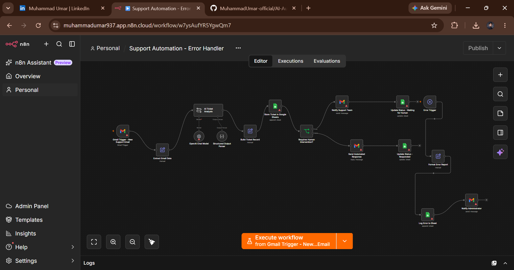

# AI Customer Support & Ticket Automation

An end-to-end **AI-powered customer support ticket automation** built
with **n8n**.

This workflow monitors incoming support emails, extracts customer
information, analyzes tickets with AI, stores structured ticket data,
decides whether human intervention is required, sends automated
responses when appropriate, and handles workflow errors.

## Workflow Overview



## What It Does

1.  Monitors Gmail for new customer support emails.
2.  Extracts email and customer information.
3.  Analyzes the ticket with an AI model.
4.  Converts the AI result into structured data.
5.  Stores the ticket in Google Sheets.
6.  Checks whether human intervention is required.
7.  Notifies the support team when human help is needed.
8.  Sends an automated response when human intervention is not required.
9.  Updates the ticket status.
10. Logs errors and notifies the administrator.

## Workflow Architecture

``` text
New Support Email
      ↓
Gmail Trigger
      ↓
Extract Email Data
      ↓
AI Ticket Analysis
      ↓
Structured Output Parser
      ↓
Build Ticket Record
      ↓
Store Ticket in Google Sheets
      ↓
Requires Human Intervention?
       /      YES  NO
      ↓    ↓
Notify     Send Automated
Support    Response
 Team         ↓
      \      /
       ↓    ↓
    Update Status
```

## Tools & Technologies

  -----------------------------------------------------------------------
  Tool / Technology                   Purpose
  ----------------------------------- -----------------------------------
  **n8n**                             Workflow orchestration and
                                      automation

  **Gmail**                           Receives support emails and sends
                                      notifications/responses

  **OpenAI / AI Model**               Analyzes incoming support tickets

  **Structured Output Parser**        Converts AI output into structured
                                      data

  **Google Sheets**                   Stores and updates ticket records

  **Edit Fields / Code Nodes**        Extracts and transforms data

  **Conditional Logic**               Routes tickets based on
                                      human-intervention requirements

  **Error Trigger**                   Handles failed workflow executions
  -----------------------------------------------------------------------

## AI Ticket Analysis

The AI analyzes incoming support requests and can produce:

-   Ticket category
-   Priority
-   Customer sentiment
-   Customer intent
-   Short summary
-   Recommended action
-   Human-intervention requirement

The structured result is then used by the workflow for routing and
record management.

## Human Escalation

When human intervention is required:

``` text
Requires Human Intervention
          ↓
Notify Support Team
          ↓
Update Status → Waiting for Human
```

This helps prevent inappropriate automated handling of tickets that need
a support specialist.

## Automated Response

When human intervention is not required:

``` text
No Human Intervention Required
          ↓
Send Automated Response
          ↓
Update Status → Responded
```

## Ticket Data

The workflow stores structured information such as:

``` text
Ticket ID
Date
Customer Name
Customer Email
Subject
Message
Category
Priority
Sentiment
Customer Intent
Summary
Recommended Action
Human Intervention Required
Status
```

## Error Handling

A dedicated error path is included:

``` text
Error Trigger
     ↓
Format Error Report
     ↓
Log Error to Google Sheets
     ↓
Notify Administrator
```

This provides visibility into failed executions and supports
troubleshooting.

## Example Use Case

A customer sends:

``` text
Subject: Payment issue with my order

I was charged for my order but the payment status
still shows as pending. Can you please check this?
```

The automation can receive the email, analyze the issue, store the
ticket, determine the appropriate handling path, notify the support team
if required, and update the ticket status.

## Business Value

This automation can help businesses:

-   Reduce repetitive support work
-   Process incoming tickets faster
-   Organize customer-support data
-   Identify tickets requiring human attention
-   Provide faster responses
-   Maintain centralized ticket records
-   Improve support-operation visibility
-   Monitor automation failures

## Security & Credentials

This workflow may require Gmail, Google Sheets, and AI-provider
credentials.

**Never commit API keys, passwords, OAuth tokens, or other secrets to
GitHub.**

For client delivery, the client should configure their own credentials
inside their n8n environment.

## Workflow Delivery

The workflow can be exported from n8n as a **JSON file** and imported
into another n8n environment.

Recommended folder structure:

``` text
AI-Customer-Support-Ticket-Automation/
├── AI_Customer_Support_Ticket_Automation.json
├── README.md
└── workflow.png
```

## Project Status

**Status:** Completed --- Portfolio Project

This project demonstrates practical experience with:

`AI Automation` `n8n` `Gmail` `OpenAI` `Google Sheets`
`Workflow Routing` `Structured Data` `Error Handling`
`Customer Support Automation`

## Author

**Muhammad Umar**

**Focus:** Data Science \| AI/ML \| AI Automation & Agents
