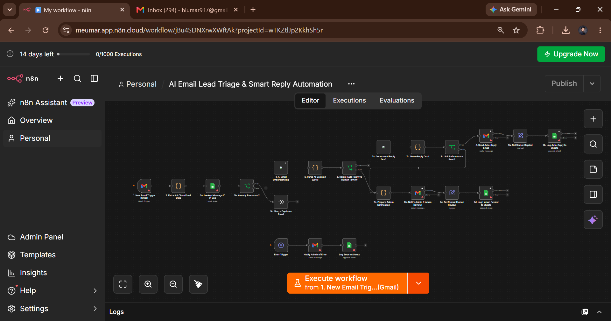

# AI Email Lead Triage & Smart Reply Automation

An AI-powered **n8n email automation workflow** that analyzes incoming email leads and intelligently decides whether an email can be answered automatically or requires human review before a response is sent.

The workflow is designed around a **human-in-the-loop approach**: simple and safe emails can be handled automatically, while sensitive, complex, high-risk, or uncertain emails are routed to a human.

---

## Workflow Overview




---

## Project Objective

The purpose of this workflow is to reduce manual email handling while keeping important business decisions under human control.

When a new email arrives, the workflow:

1. Captures the incoming email through Gmail.
2. Extracts and cleans the email data.
3. Checks whether the email has already been processed.
4. Uses an AI model to understand the email.
5. Decides whether an automatic reply is safe.
6. Routes the email to either:
   - `AUTO_REPLY`
   - `HUMAN_REVIEW`
7. Generates and sends an AI reply for safe emails.
8. Notifies an administrator when human review is required.
9. Logs the result in Google Sheets.
10. Handles workflow errors through a dedicated error path.

---

## How It Works

### 1. New Email Trigger

The workflow starts when a new email arrives in the connected Gmail account.

The workflow extracts information such as:

- Sender name
- Sender email
- Subject
- Email body
- Message ID
- Thread information
- Received date/time

---

### 2. Extract & Clean Email Data

The incoming email data is processed before being sent to the AI.

This step helps handle:

- HTML email content
- Empty subjects
- Empty email bodies
- Sender information
- Email formatting
- Structured email data

---

### 3. Duplicate Email Check

Before processing the email, the workflow checks Google Sheets using the email/message identifier.

If the email has already been processed:

```text
Already Processed
        ↓
       STOP
```

This prevents duplicate AI processing and accidental duplicate replies.

---

### 4. AI Email Understanding

The email is sent to an AI model for analysis.

The AI determines information such as:

- Email category
- Sender intent
- Priority
- Whether a response is required
- Whether automatic response is safe
- Whether human review is required
- Reason for the decision
- Suggested response

Example categories include:

- Sales Inquiry
- Service Inquiry
- Product Question
- Pricing Request
- Meeting Request
- General Inquiry
- Customer Support
- Complaint
- Refund Request
- Partnership
- Job Opportunity
- Spam
- Other

---

## AI Decision System

The most important part of this workflow is the AI decision:

```text
              Incoming Email
                    ↓
             AI Understanding
                    ↓
           Auto-Reply Safe?
             /            \
           YES             NO
            ↓               ↓
       AUTO_REPLY      HUMAN_REVIEW
```

The AI should only select `AUTO_REPLY` when the email is clear, low-risk, and answerable using approved business information.

If the AI is uncertain, the email is routed to `HUMAN_REVIEW`.

---

# AUTO_REPLY Branch

For emails that can safely be handled automatically:

```text
AUTO_REPLY
    ↓
Generate AI Reply Draft
    ↓
Parse Reply Draft
    ↓
Safety Re-check
    ↓
Send Reply Email
    ↓
Set Status: Replied
    ↓
Log to Google Sheets
```

### Automatic replies can be used for examples such as:

- General service questions
- Basic product/service information
- General availability questions
- Simple meeting requests
- Frequently asked questions
- Other low-risk questions with known answers

Before sending, the generated reply passes through a **Safety Re-check** to reduce the risk of sending an inappropriate or unsupported response.

---

# HUMAN_REVIEW Branch

For emails that require a human decision:

```text
HUMAN_REVIEW
      ↓
Prepare Admin Notification
      ↓
Notify Admin
      ↓
Set Status: Human Review
      ↓
Human Approves / Edits Draft
      ↓
Log to Google Sheets
```

Human review can be required for:

- Custom pricing
- Price negotiation
- Refund requests
- Complaints
- Legal or contractual questions
- Sensitive information
- High-value leads
- Complex business decisions
- Unclear requests
- Low AI confidence
- Any situation where the AI cannot safely determine the answer

The workflow does not automatically send a response in these cases.

---

## Safety Logic

The workflow follows a conservative automation strategy.

The AI should not automatically reply when:

- The request requires a business decision.
- Custom pricing or negotiation is involved.
- A refund or financial decision is required.
- Legal or contractual information is requested.
- Sensitive information is involved.
- The email is a complaint.
- The AI is uncertain.
- Required information is missing.
- The request cannot be answered using approved business information.

In uncertain situations, the workflow routes the email to:

```text
HUMAN_REVIEW
```

---

## Google Sheets Logging

Processed emails and workflow decisions are recorded in Google Sheets.

Example fields include:

| Field | Description |
|---|---|
| Message ID | Unique email identifier |
| Thread ID | Gmail conversation/thread identifier |
| Sender Name | Name of the sender |
| Sender Email | Sender email address |
| Subject | Email subject |
| Category | AI-detected email category |
| Intent | Detected sender intent |
| Priority | Email priority |
| AI Summary | Short AI-generated summary |
| AI Confidence | Confidence level from AI analysis |
| Auto Reply Allowed | Whether automatic reply is allowed |
| Human Review Required | Whether human review is required |
| Review Reason | Reason for human escalation |
| Response | Generated response/draft |
| Status | Current processing status |
| Processed At | Processing timestamp |

---

## Workflow Statuses

The workflow can use statuses such as:

```text
New
Analyzing
Auto Reply
Human Review
Approved
Rejected
Replied
Closed
Error
```

---

## Error Handling

A dedicated error-handling path is included in the workflow.

```text
Any Workflow Error
        ↓
Error Trigger
        ↓
Notify Admin of Error
        ↓
Log Error to Google Sheets
```

This helps identify failures without silently losing an incoming email.

If an AI or processing step fails, the workflow can be configured to send the email for human review instead of attempting an unsafe automatic response.

---

## Technologies

- n8n
- Gmail
- AI / LLM
- Google Sheets
- IF / Switch logic
- Code nodes
- Email automation
- Error handling
- Human-in-the-loop workflow design

---

## Key Features

- Gmail-based email triggering
- AI-powered email understanding
- Intent and category detection
- Automatic reply decision
- Human review routing
- AI reply generation
- Safety re-check before sending
- Duplicate email protection
- Google Sheets logging
- Admin notifications
- Error handling
- Status tracking
- Human-in-the-loop decision making

---

## Business Use Case

This workflow can be used by businesses that receive a large number of email leads or customer inquiries.

For example:

```text
Customer:
"Hi, I want to know what AI automation services you provide."

        ↓

AI analyzes the email

        ↓

Safe & General Inquiry

        ↓

AUTO_REPLY

        ↓

AI generates professional response

        ↓

Email sent automatically
```

While a more sensitive request could follow:

```text
Customer:
"Can you give me a 40% discount and change the payment terms?"

        ↓

AI analyzes the request

        ↓

Pricing / Negotiation

        ↓

HUMAN_REVIEW

        ↓

Admin receives notification

        ↓

Human reviews and responds
```

---

## Business Value

This automation can help businesses:

- Reduce repetitive email handling
- Respond faster to simple inquiries
- Keep complex decisions under human control
- Reduce accidental automated responses
- Organize incoming leads
- Maintain a record of email decisions
- Improve response consistency
- Scale email operations

---

## Security & Credentials

Credentials and sensitive information should not be stored inside the GitHub repository.

Before using this workflow:

- Configure your own Gmail credentials.
- Configure your AI provider credentials.
- Configure Google Sheets credentials.
- Keep API keys private.
- Never commit passwords or tokens.
- Review Gmail permissions before production use.
- Use appropriate access controls for business data.

---

## Project Structure

```text
AI-Email-Lead-Triage-and-Smart-Reply/
│
├── AI_Email_Lead_Triage_Workflow.json
├── README.md
└── workflow.png
```

---

## How to Use

### 1. Import the Workflow

Import the `.json` workflow file into your n8n instance.

### 2. Configure Credentials

Connect your own:

- Gmail account
- AI/LLM provider
- Google Sheets account

### 3. Configure Business Information

Update the AI prompts and business information used for automatic responses.

### 4. Configure Safety Rules

Define which types of emails are safe for automatic responses and which must always require human review.

### 5. Test With Sample Emails

Test different scenarios:

- Simple inquiry
- Sales lead
- Pricing request
- Complaint
- Meeting request
- Complex request
- Unclear email

### 6. Activate the Workflow

After testing the workflow and verifying the safety rules, activate it for incoming emails.

---

## Portfolio Focus

This project demonstrates practical experience with:

- AI Automation
- n8n Workflow Development
- AI-powered Decision Making
- Email Automation
- Human-in-the-Loop Systems
- API & Service Integrations
- Business Process Automation
- AI Response Generation
- Error Handling
- Workflow Logging

---

## Author

**Muhammad Umar**

**Data Scientist | Data Analyst | AI/ML | AI Automation & Agents**

Focused on building practical AI-powered solutions, automation workflows, and intelligent systems that solve real-world business problems.

---

## Project Status

**Completed**

This workflow was built as a practical AI automation portfolio project using n8n.
