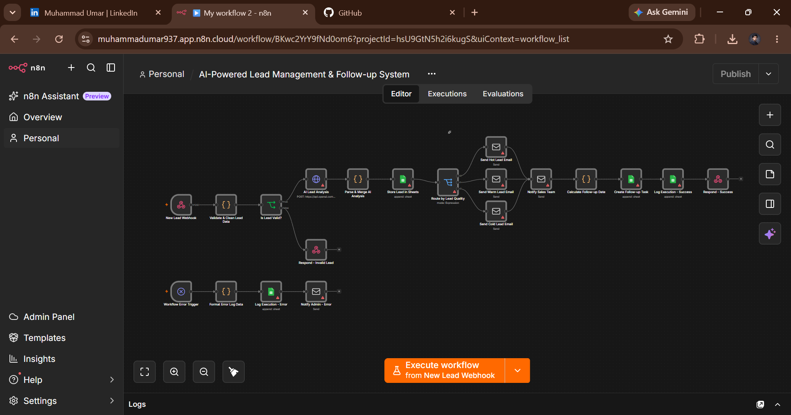

#  AI-Powered Lead Management & Follow-up System

An end-to-end **AI-powered lead management automation** built with
**n8n**.\
This workflow automates the process of receiving, validating, analyzing,
qualifying, storing, and following up with new business leads.

------------------------------------------------------------------------

##  Workflow Overview



------------------------------------------------------------------------

##  Project Objective

The goal of this automation is to reduce repetitive manual work in lead
management.

When a new lead arrives, the workflow automatically:

1.  Receives the lead through a **Webhook**
2.  Validates and cleans the submitted data
3.  Uses an **AI model** to analyze the lead
4.  Extracts and parses the AI analysis
5.  Stores the lead in **Google Sheets**
6.  Routes the lead based on its quality
7.  Sends a personalized email for **Hot, Warm, or Cold** leads
8.  Notifies the internal team
9.  Calculates a follow-up date
10. Creates a follow-up task
11. Logs successful processing
12. Handles invalid leads and workflow errors

------------------------------------------------------------------------

##  Workflow Architecture

``` text
New Lead
   │
   ▼
Webhook
   │
   ▼
Validate & Clean Lead Data
   │
   ├──────────────► Invalid Lead → Response
   │
   ▼
AI Lead Analysis
   │
   ▼
Parse AI Analysis
   │
   ▼
Store Lead in Google Sheets
   │
   ▼
Route by Lead Quality
   │
   ├── Hot  ──► Hot Lead Email
   │
   ├── Warm ──► Warm Lead Email
   │
   └── Cold ──► Cold Lead Email
                    │
                    ▼
             Notify Sales Team
                    │
                    ▼
             Calculate Follow-up Date
                    │
                    ▼
              Create Follow-up Task
                    │
                    ▼
               Log Execution
                    │
                    ▼
              Respond - Success
```

A separate error-handling branch monitors failed workflow executions:

``` text
Workflow Error Trigger
        │
        ▼
Format Error Log Data
        │
        ▼
Log Execution - Error
        │
        ▼
Notify Admin - Error
```

------------------------------------------------------------------------

##  Tools & Technologies

  -----------------------------------------------------------------------
  Tool / Technology                   Purpose
  ----------------------------------- -----------------------------------
  **n8n**                             Workflow orchestration and
                                      automation

  **Webhook**                         Receives new lead data and starts
                                      the workflow

  **AI / LLM API**                    Analyzes and qualifies incoming
                                      leads

  **Google Sheets**                   Stores lead information and
                                      execution logs

  **Gmail / Email**                   Sends personalized lead and
                                      internal notifications

  **JavaScript / Code nodes**         Validation, data transformation,
                                      parsing, and date calculations

  **Conditional Routing**             Routes leads based on quality

  **Error Workflow**                  Captures failures and notifies the
                                      administrator
  -----------------------------------------------------------------------

------------------------------------------------------------------------

##  AI Lead Qualification

The AI analysis is used to understand each incoming lead and generate
structured information such as:

-   Lead category
-   Customer intent
-   Lead quality
-   Priority
-   Lead summary
-   Recommended next action

The workflow then uses the AI-generated **lead quality** to determine
the appropriate email and follow-up path.

### Lead Routing

  Lead Quality   Automated Action
  -------------- ---------------------------------------
   **Hot**     Send high-priority personalized email
   **Warm**    Send nurturing email
   **Cold**    Send friendly follow-up email

------------------------------------------------------------------------

##  Automated Communication

The workflow contains separate email paths for:

### Hot Leads

A personalized response acknowledging the inquiry and indicating that
the team will follow up soon.

### Warm Leads

A helpful response designed to continue the conversation and gather
additional information.

### Cold Leads

A friendly response while keeping the lead in the system for future
follow-up.

The workflow also sends an internal notification to the sales/admin team
with important lead information and the AI-generated analysis.

------------------------------------------------------------------------

##  Data Storage

Lead information is stored in **Google Sheets** for easy tracking and
management.

Example fields:

``` text
Lead ID
Date
Name
Email
Phone
Company
Service Required
Budget
Message
Lead Category
Customer Intent
Lead Quality
Priority
AI Summary
Recommended Action
Status
Follow-up Date
```

------------------------------------------------------------------------

## ⏰ Follow-up Automation

The workflow calculates a follow-up date based on the lead quality.

Example logic:

``` text
Hot  → Follow up after 1 day
Warm → Follow up after 3 days
Cold → Follow up after 7 days
```

This helps ensure that qualified leads are not forgotten after the
initial interaction.

------------------------------------------------------------------------

##  Validation & Error Handling

The workflow includes two levels of protection:

### Invalid Lead Handling

Before AI processing, incoming data is validated and cleaned.

If required information is missing or invalid:

``` text
Invalid Lead
     ↓
Response - Invalid Lead
```

The lead does not continue through the normal processing path.

### Workflow Error Handling

A separate error workflow handles unexpected failures:

``` text
Workflow Error Trigger
        ↓
Format Error Log Data
        ↓
Log Execution - Error
        ↓
Notify Admin - Error
```

This provides visibility into failed executions and makes
troubleshooting easier.

------------------------------------------------------------------------

##  Project Structure

``` text
ai-lead-management-n8n/
│
├── README.md
└── workflow.png
```

The `workflow.png` file contains the visual workflow diagram shown
above.

------------------------------------------------------------------------

##  How It Works --- Example

A potential customer submits:

``` text
Name: Ali Khan
Company: Example Solutions
Service: AI Automation
Budget: $500
Message: We need an automated system to manage and qualify our incoming leads.
```

The workflow processes the request:

``` text
Lead Submitted
      ↓
Webhook receives data
      ↓
Data validation & cleaning
      ↓
AI analyzes the lead
      ↓
Lead is classified
      ↓
Lead saved to Google Sheets
      ↓
Correct email path selected
      ↓
Sales team notified
      ↓
Follow-up date calculated
      ↓
Follow-up task created
      ↓
Execution logged
```

------------------------------------------------------------------------

##  Business Value

This automation can help businesses:

-   Reduce manual lead-processing work
-   Respond to potential customers faster
-   Automatically prioritize leads
-   Keep lead information organized
-   Maintain consistent follow-up
-   Reduce missed opportunities
-   Give sales teams useful AI-generated context
-   Monitor workflow failures through automated error logging

------------------------------------------------------------------------

##  Credentials & Security

This project uses external services that may require credentials, such
as:

-   AI/LLM API credentials
-   Google Sheets credentials
-   Email/Gmail credentials

**API keys, passwords, OAuth tokens, and other secrets should never be
committed to GitHub or shared publicly.**

When delivering the workflow to a client, export the workflow without
exposing sensitive credentials and configure the client's credentials
inside their own n8n environment.

------------------------------------------------------------------------

##  Workflow Delivery

The n8n workflow can be exported as a **JSON file** and imported into
another n8n environment.

After importing, the client should configure their own:

-   AI credentials
-   Google Sheets credentials
-   Email credentials
-   Environment-specific settings

The JSON workflow is therefore portable while keeping the client's
credentials under their control.

------------------------------------------------------------------------

##  Project Status

**Status:** Completed --- Portfolio Project

This project was built as a practical demonstration of **AI workflow
automation, API integration, data processing, lead qualification,
communication automation, and error handling** using n8n.

------------------------------------------------------------------------

##  Author

**Muhammad Umar**

**Focus:** Data Science \| AI/ML \| AI Automation & Agents

------------------------------------------------------------------------

## ⭐ Key Skills Demonstrated

`n8n` `AI Automation` `AI/LLM` `Webhooks` `APIs` `Google Sheets`
`Email Automation` `JavaScript` `Data Validation` `Workflow Design`
`Error Handling` `Lead Management`
